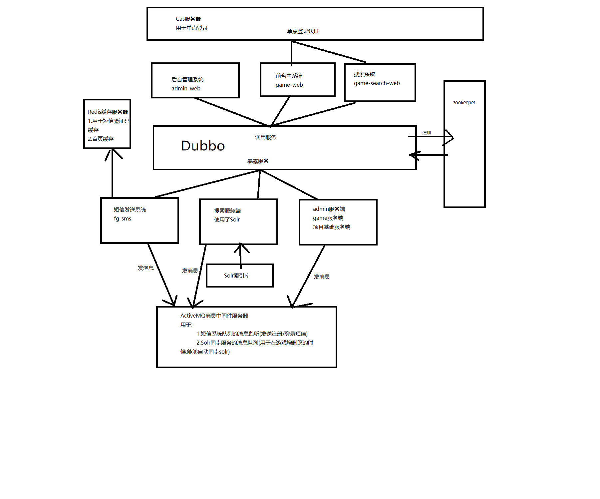

# FaveGame——架构设计



---
请不要用于商业用途

文档中可能留存有我编码测试时使用的服务器（地址），请改成你自己的服务器地址

PS：请不要攻击我，谢谢QWQ

Cas单点登录模块地址(需要先Build再单独部署到Tomcat服务器) https://github.com/yoko-murasame/favegame-cas

在线演示视频：http://img.dmdream.cn/favegame.mp4
### 实体类相关

##### 1.抽象公共基类设计

Base.java

```java
import com.baomidou.mybatisplus.annotation.IdType;
import com.baomidou.mybatisplus.annotation.TableField;
import com.baomidou.mybatisplus.annotation.TableId;
import com.fasterxml.jackson.annotation.JsonFormat;
import lombok.Getter;
import lombok.Setter;

import java.util.Date;

@Getter
@Setter
public abstract class Base {

    @TableId(type = IdType.AUTO)
    protected Integer id;//无意义自增主键

    @TableField("createTime")
    @JsonFormat(pattern = "yyyy-MM-dd HH:mm:ss", timezone = "GMT+8")
    protected Date createTime = new Date();//创建时间，自动生成

    @TableField("destroyTime")
    @JsonFormat(pattern = "yyyy-MM-dd HH:mm:ss", timezone = "GMT+8")
    protected Date destroyTime = new Date();//销毁时间，自动生成

    @TableField("version")
    protected Integer version = 1;//乐观锁，初始化为1

    @TableField("isValid")
    protected Integer isValid = 1;//是否启用，初始化为1

}

```


---

### Mapper相关

##### 1.MBP多表查询

* [最简单的 MyBatis Plus 的多表联接、分页查询实现方法](<https://blog.csdn.net/larger5/article/details/82082819>) 


##### 2.设置unique

```sql
ALTER TABLE `tab_admin` ADD unique(`gmAdminUsername`);
```


##### 3.多表Count查询

sql

```sql
 select g.*,t.id as gmTypeId,t.gmTypeEnName as gmTypeName,p.id as gmPublisherId,p.gmPublisherName as gmPublisherName
  ,o.id as gmOperatorId,o.gmOperatorName as gmOperatorName,
        (select count(1) from tab_collection c where c.gmGameId = g.id) as colleCount,
        (select count(1) from tab_attention a where a.gmGameId = g.id) as attentionCount 
  from tab_game g
  left join tab_type t on g.gmTypeId = t.id
  left join tab_publisher p on g.gmPublisherId = p.id
  left join tab_operator o on g.gmOperatorId = o.id
--       left join (select count(distinct gmCollectorId) ccCount,gmGameId from tab_collection group by gmGameId) cc on cc.gmGameId = g.id
-- 			left join tab_collection c on c.gmGameId=g.id GROUP BY g.id
```

mapper

```xml
    <select id="findAllGameVoByPage" parameterType="cn.dmdream.entity.Game" resultType="cn.dmdream.entity.vo.GameVo">
        select g.*,t.id as gmTypeId,t.gmTypeEnName as gmTypeName,p.id as gmPublisherId,p.gmPublisherName as
        gmPublisherName
        ,o.id as gmOperatorId,o.gmOperatorName as gmOperatorName
        ,(select count(1) from tab_collection c where c.gmGameId = g.id) as countCollector
        ,(select count(1) from tab_attention a where a.gmGameId = g.id) as countAttentrion <!--查询收藏和关注人数-->
        from tab_game g
        left join tab_type t on g.gmTypeId = t.id
        left join tab_publisher p on g.gmPublisherId = p.id
        left join tab_operator o on g.gmOperatorId = o.id
        <where>
            g.isValid = 1
            <if test="game.gmTypeId!=null and game.gmTypeId!=''"><!--判断是否类型查询-->
                and g.gmTypeId = #{game.gmTypeId}
            </if>
            <if test="game.gmName!=null and game.gmName!=''"><!--判断是否游戏名模糊查询-->
                and g.gmName like '%${game.gmName}%'
            </if>
        </where>

        order by g.createTime desc
        limit #{start},#{pageSize};
    </select>
```


##### 4.mybatis传入基本&实体参数

[mybatis中@Param的用法和作用](https://www.cnblogs.com/goloving/p/9241449.html) 

```java
public List<student> selectuser(@Param(value = "page")int pn ,@Param(value = "st")student student);

<select id="selectuser" resultType="com.user.entity.student">
    SELECT * FROM student
    where sname like concat(concat("%",#{st.sname}),"%")
    LIMIT #{page} ,5
</select>
```


##### 5.动态排序

java

```java
List<GameVo> findAllGameVoByPage(...,@Param("orderField") String orderField);
```

mapper

```xml
    <select id="findAllGameVoByPage" parameterType="cn.dmdream.entity.Game" resultType="cn.dmdream.entity.vo.GameVo">
 		<!--...........其余省略..........-->
        <if test="orderField!=null and orderField!=''">
          order by #{orderField}
        </if>
        limit #{start},#{pageSize};
    </select>
```


---

### Service相关

##### 1.在dubbo中的注册名称

fg-game-manager-service端口20880


---

### Controller相关

##### 1.CDN

amazeUI生产版

```html
<link rel="stylesheet" href="http://cdn.amazeui.org/amazeui/2.7.2/css/amazeui.min.css">
<script src="https://cdn.bootcss.com/jquery/3.4.0/jquery.min.js"></script>
<script src="http://cdn.amazeui.org/amazeui/2.7.2/js/amazeui.min.js"></script>
```

开发版

```html
<link href="https://cdn.bootcss.com/twitter-bootstrap/3.4.0/css/bootstrap.css" rel="stylesheet">
<script src="https://cdn.bootcss.com/jquery/3.4.0/jquery.js"></script>
<script src="https://cdn.bootcss.com/twitter-bootstrap/3.4.0/js/bootstrap.js"></script>
```

生产版

```html
<link href="https://cdn.bootcss.com/twitter-bootstrap/3.4.0/css/bootstrap.min.css" rel="stylesheet">
<script src="https://cdn.bootcss.com/jquery/3.4.0/jquery.min.js"></script>
<script src="https://cdn.bootcss.com/twitter-bootstrap/3.4.0/js/bootstrap.min.js"></script>
```

七牛云js

```html
<script src="https://unpkg.com/qiniu-js@2.5.4/dist/qiniu.min.js"></script>
```


##### 2.Thymeleaf

- HTMl加入约束头

  ```html
  <html xmlns:th="http://www.thymeleaf.org">
  ```


##### 3.JS取Thymeleaf值

> [Thymeleaf前后端传值 页面取值与js取值](<https://blog.csdn.net/u013848401/article/details/78601672>) 

```html
<script th:inline="javascript">
    var message = [[${message}]];
    console.log(message);
</script>
```


##### 4.th:selected

* <https://blog.csdn.net/Lei_Da_Gou/article/details/80741573> 

```html
<select onchange="getChilds(this.value)" class="form-control select2" id="catId" name="catId">
   <option value=""> -- 请选择 -- </option>
   <option  th:selected="${goods.catId eq c.id}" th:each="c:${categoryList}"  th:value="${c.id}" th:text="${c.name}" value="1">蔬菜</option>
</select>
```


##### 5.JQ操作class

> [jQuery中的class操作](<https://blog.csdn.net/sinat_25017107/article/details/77977376>) 

* addClass()
* removeClass()
* hasClass()
* toggleClass()


##### 6.AjaxFrom插件

* [jQuery插件 -- Form表单插件jquery.form.js](<https://blog.csdn.net/zzq58157383/article/details/7718956>) 
* [JQuery中的AjaxForm和AjaxSubmit](<https://blog.csdn.net/zhanshenyn/article/details/84130435>) 
* [ajax 不进入回调函数 success](<https://blog.csdn.net/wabiaozia/article/details/50602672>) ——设置dataType属性

**示例：**

html

```html
<form class="am-form tpl-form-line-form" id="id-form-saveOrUpdate"
      action="/admin/game/saveOrUpdate" method="post">
    <!--游戏名-->
    <div class="am-form-group">
        <label for="id-gmName" class="am-u-sm-3 am-form-label">游戏名 <span
                class="tpl-form-line-small-title">GameName</span></label>
        <div class="am-u-sm-9">
            <input type="text" class="tpl-form-input" th:name="gmName" id="id-gmName"
                   placeholder="请输入游戏名称">
            <small>游戏名必填</small>
        </div>
    </div>
    <!--提交按钮-->
    <div class="am-form-group">
        <div class="am-u-sm-9 am-u-sm-push-3">
            <button type="button" id="id-form-btn-saveOrUpdate"
                    class="am-btn am-btn-primary tpl-btn-bg-color-success ">提交
            </button>
        </div>
    </div>
</form>

```

js

```js
//监听form表单提交
$("#id-form-btn-saveOrUpdate").on("click",function () {//监听提交按钮
    $("#id-form-saveOrUpdate").ajaxSubmit({//获取表单对象进行异步提交
        //提交前的回调函数
        beforeSubmit: function (formData, jqForm, options) {
            //formData: 数组对象，提交表单时，Form插件会以Ajax方式自动提交这些数据，格式如：[{name:user,value:val },{name:pwd,value:pwd}]
            //jqForm:   jQuery对象，封装了表单的元素
            //options:  options对象
            var queryString = $.param(formData);   //name=1&address=2
            var formElement = jqForm[0];              //将jqForm转换为DOM对象
            console.log(formElement);//输出表单对象,可以用于获取表单值
            console.log(queryString);//输出拼接的字符串id=&gmName=&gmVersion=&gmTypeId=-1...

            //处理所有的必填参数
            var gmName = formElement.gmName.value;
            if(gmName == null || gmName == ""){
                showGritter("消息","游戏名不能为空!");
                return false;
            }
            return true;  //只要不返回false，表单都会提交,在这里可以对表单元素进行验证
        },
        //成功后的回调函数
        success:function (res) {
            console.log("inner");
            console.log(res);
            if (res.status == 200) {
                showGritter("消息",res.msg);
                setTimeout(function(){window.location.reload();},1000);
            }else{
                showGritter("消息",res.msg);
            }
        },
        //这里要是json,要不无success回调
        dataType: 'json',           //html(默认), xml, script, json...接受服务端返回的类型
        //clearForm: true,          //成功提交后，清除所有表单元素的值
        //resetForm: true,          //成功提交后，重置所有表单元素的值
        timeout: 3000,               //限制请求的时间，当请求大于3秒后，跳出请求
    })
});
```


##### 7.disabled设置

* [input file类型，文件类型的限制](https://www.cnblogs.com/Joans/p/3158582.html) 

* JQuery设置和去除disabled属性的5种方法总结

  ```js
  //两种方法设置disabled属性 
  $('#areaSelect').attr("disabled",true); 
  $('#areaSelect').attr("disabled","disabled"); 
  
  //三种方法移除disabled属性 
  $('#areaSelect').attr("disabled",false); 
  $('#areaSelect').removeAttr("disabled"); 
  $('#areaSelect').attr("disabled",""); 
  ```


##### 8.amzUI设置Select回选

- <http://amazeui.org/javascript/selected#js-cao-zuo-select> 

js

```js
//游戏类型回选
$("#id-gmTypeId").val(g.gmTypeId);//回去select对象
var option = $("#id-gmTypeId").find('option[value="+g.gmTypeId+"]')[0];//获取option对象
$(option).attr('selected', true);//设置选中状态
$("#id-gmTypeId").trigger('changed.selected.amui');//一定要触发此事件
//发布者回选
$("#id-gmPublisherId").val(g.gmPublisherId);
option = $("#id-gmPublisherId").find('option[value="+g.gmPublisherId+"]')[0];
$(option).attr('selected', true);
$("#id-gmPublisherId").trigger('changed.selected.amui');
//发布日期回填
$("#id-gmPubdate").val(g.gmPubdate);
//运营商回选
$("#id-gmOperatorId").val(g.gmOperatorId);
option = $("#id-gmOperatorId").find('option[value="+g.gmOperatorId+"]')[0];
$(option).attr('selected', true);
$("#id-gmOperatorId").trigger('changed.selected.amui');
```


##### 9.手机号正则

js版本

```js
function isPoneAvailable($poneInput) {  
          var myreg=/^[1][3,4,5,7,8][0-9]{9}$/;  
          if (!myreg.test($poneInput.val())) {  
              return false;  
          } else {  
              return true;  
          }  
      } 
```

java版本

```java
public static boolean isPhone(String phone) {
    String regex = "^((13[0-9])|(14[5,7,9])|(15([0-3]|[5-9]))|(166)|(17[0,1,3,5,6,7,8])|(18[0-9])|(19[8|9]))\\d{8}$";
    if (phone.length() != 11) {
        MToast.showToast("手机号应为11位数");
        return false;
    } else {
        Pattern p = Pattern.compile(regex);
        Matcher m = p.matcher(phone);
        boolean isMatch = m.matches();
        LogUtil.e(isMatch);
        if (!isMatch) {
            MToast.showToast("请填入正确的手机号");
        }
        return isMatch;
    }
}
/*
中国电信号段 133、149、153、173、177、180、181、189、199
中国联通号段 130、131、132、145、155、156、166、175、176、185、186
中国移动号段 134(0-8)、135、136、137、138、139、147、150、151、152、157、158、159、178、182、183、184、187、188、198
其他号段
14号段以前为上网卡专属号段，如中国联通的是145，中国移动的是147等等。
虚拟运营商
电信：1700、1701、1702
移动：1703、1705、1706
联通：1704、1707、1708、1709、171
卫星通信：1349
*/
```


##### 10.验证码

工具类CaptchaUtil

```java
package cn.dmdream.game.utils;

import java.awt.*;
import java.awt.image.BufferedImage;
import java.util.Random;

/**
 * 验证码工具类
 *
 * @author &lt;a href="http://www.micmiu.com"&gt;Michael Sun&lt;/a&gt;
 */
public class CaptchaUtil {

    // 随机产生的字符串
    private static final String RANDOM_STRS = "0123456789ABCDEFGHIJKLMNOPQRSTUVWXYZ";

    private static final String FONT_NAME = "Fixedsys";
    private static final int FONT_SIZE = 18;

    private Random random = new Random();

    private int width = 80;// 图片宽
    private int height = 25;// 图片高
    private int lineNum = 50;// 干扰线数量
    private int strNum = 4;// 随机产生字符数量

    /**
     * 生成随机图片
     */
    public BufferedImage genRandomCodeImage(StringBuffer randomCode) {
        // BufferedImage类是具有缓冲区的Image类
        BufferedImage image = new BufferedImage(width, height,
                BufferedImage.TYPE_INT_BGR);
        // 获取Graphics对象,便于对图像进行各种绘制操作
        Graphics g = image.getGraphics();
        // 设置背景色
        g.setColor(getRandColor(200, 250));
        g.fillRect(0, 0, width, height);

        // 设置干扰线的颜色
        g.setColor(getRandColor(110, 120));

        // 绘制干扰线
        for (int i = 0; i <= lineNum; i++) {
            drowLine(g);
        }
        // 绘制随机字符
        g.setFont(new Font(FONT_NAME, Font.ROMAN_BASELINE, FONT_SIZE));
        for (int i = 1; i <= strNum; i++) {
            randomCode.append(drowString(g, i));
        }
        g.dispose();
        return image;
    }

    /**
     * 给定范围获得随机颜色
     */
    private Color getRandColor(int fc, int bc) {
        if (fc > 255){
            fc = 255;
        }
        if (bc > 255){
            bc = 255;
        }
        int r = fc + random.nextInt(bc - fc);
        int g = fc + random.nextInt(bc - fc);
        int b = fc + random.nextInt(bc - fc);
        return new Color(r, g, b);
    }

    /**
     * 绘制字符串
     */
    private String drowString(Graphics g, int i) {
        g.setColor(new Color(random.nextInt(101), random.nextInt(111), random
                .nextInt(121)));
        String rand = String.valueOf(getRandomString(random.nextInt(RANDOM_STRS
                .length())));
        g.translate(random.nextInt(3), random.nextInt(3));
        g.drawString(rand, 13 * i, 16);
        return rand;
    }

    /**
     * 绘制干扰线
     */
    private void drowLine(Graphics g) {
        int x = random.nextInt(width);
        int y = random.nextInt(height);
        int x0 = random.nextInt(16);
        int y0 = random.nextInt(16);
        g.drawLine(x, y, x + x0, y + y0);
    }

    /**
     * 获取随机的字符
     */
    private String getRandomString(int num) {
        return String.valueOf(RANDOM_STRS.charAt(num));
    }

//    public static void main(String[] args) {
//        CaptchaUtil tool = new CaptchaUtil();
//        StringBuffer code = new StringBuffer();
//        BufferedImage image = tool.genRandomCodeImage(code);
//        System.out.println("random code = " + code);
//        try {
//            // 将内存中的图片通过流动形式输出到客户端
//            ImageIO.write(image, "JPEG", new FileOutputStream(new File(
//                    "/Users/wangsaichao/Desktop/random-code.jpg")));
//        } catch (Exception e) {
//            e.printStackTrace();
//        }
//
//    }
}
```

Controller中使用

```java
public static final String KEY_CAPTCHA = "capcha";

@RequestMapping("/capcha.jpg")
public void getCaptcha(HttpServletRequest request, HttpServletResponse response)throws ServletException, IOException {
    // 设置相应类型,告诉浏览器输出的内容为图片
    response.setContentType("image/jpeg");
    // 不缓存此内容
    response.setHeader("Pragma", "No-cache");
    response.setHeader("Cache-Control", "no-cache");
    response.setDateHeader("Expire", 0);
    try {

        HttpSession session = request.getSession();

        CapchaUtil tool = new CapchaUtil();
        StringBuffer code = new StringBuffer();
        BufferedImage image = tool.genRandomCodeImage(code);
        session.removeAttribute(KEY_CAPTCHA);
        session.setAttribute(KEY_CAPTCHA, code.toString());

        // 将内存中的图片通过流动形式输出到客户端
        ImageIO.write(image, "JPEG", response.getOutputStream());

    } catch (Exception e) {
        e.printStackTrace();
    }

}
```


##### 11.公共页面提取

* [官方文档](<https://www.thymeleaf.org/doc/tutorials/3.0/usingthymeleaf.html#template-layout>) 

* [Thymeleaf 公共css,js提取及自有css,js导入](<https://www.jianshu.com/p/2102fa4772ba>) 

* [使用Thymeleaf模板封装页面公有部分（CSS，JS，导航栏等）](<https://blog.csdn.net/YINLINNEVERG/article/details/80543608>) 

* [thymeleaf学习笔记（公共页面提取）](<https://blog.csdn.net/wangtong01/article/details/87273752>) 

* [Location 对象](<http://www.w3school.com.cn/jsref/dom_obj_location.asp>) 

  | 属性                                                         | 描述                                          |
  | :----------------------------------------------------------- | :-------------------------------------------- |
  | [hash](http://www.w3school.com.cn/jsref/prop_loc_hash.asp)   | 设置或返回从井号 (#) 开始的 URL（锚）。       |
  | [host](http://www.w3school.com.cn/jsref/prop_loc_host.asp)   | 设置或返回主机名和当前 URL 的端口号。         |
  | [hostname](http://www.w3school.com.cn/jsref/prop_loc_hostname.asp) | 设置或返回当前 URL 的主机名。                 |
  | [href](http://www.w3school.com.cn/jsref/prop_loc_href.asp)   | 设置或返回完整的 URL。                        |
  | [pathname](http://www.w3school.com.cn/jsref/prop_loc_pathname.asp) | 设置或返回当前 URL 的路径部分。               |
  | [port](http://www.w3school.com.cn/jsref/prop_loc_port.asp)   | 设置或返回当前 URL 的端口号。                 |
  | [protocol](http://www.w3school.com.cn/jsref/prop_loc_protocol.asp) | 设置或返回当前 URL 的协议。                   |
  | [search](http://www.w3school.com.cn/jsref/prop_loc_search.asp) | 设置或返回从问号 (?) 开始的 URL（查询部分）。 |

###### 注意点

* th:replace传参可用 `_` 或者 `~{}` 代替空值

  ```html
  <!--使用 ~{} 代替空值-->
  <head th:replace="base :: common_header(~{::title},~{})">
  
    <title>Awesome - Main</title>
  
  </head>
  <!--使用 _ 代替空值-->
  <head th:replace="base :: common_header(_,~{::link})">
  
    <title>Awesome - Main</title>
  
    <link rel="stylesheet" th:href="@{/css/bootstrap.min.css}">
    <link rel="stylesheet" th:href="@{/themes/smoothness/jquery-ui.css}">
  
  </head>
  ```

* th:replace和th:fragment传递对象

  ```html
  <!--fragment中使用${xxx}作为参数，xxx是从replace传递过来的字符串-->
  <head th:fragment="common_header(${obj})">
    <title>${obj.username}</title>
  </head>
  <!--th:replace传递一个字符串过去，字符串为域中的某个key的值-->
  <div th:replace="base :: common_header(user)"></div>
  ```

* JavaScript使用th:inline可以将对象转成jsonObject

  ```html
  <script th:inline="javascript">
      ...
      var user = /*[[${session.user}]]*/ null;
      ...
  </script>
  <!--解析结果-->
  <script th:inline="javascript">
      ...
      var user = {"age":null,"firstName":"John","lastName":"Apricot",
                  "name":"John Apricot","nationality":"Antarctica"};
      ...
  </script>
  ```

  

###### 使用示例

common.html

```html
<!--公共页首部分,带style-->
<head th:fragment="commonHeaderWithStyle(description,title,links,style)">
    <meta charset="utf-8">
    <meta http-equiv="X-UA-Compatible" content="IE=edge">
    <title th:replace="${title}">Fave Game Admin</title>
    <meta name="description" content="后台-游戏管理" th:content="${description}">
    <meta name="keywords" content="index">
    <meta name="viewport" content="width=device-width, initial-scale=1">
    <meta name="renderer" content="webkit">
    <meta http-equiv="Cache-Control" content="no-siteapp"/>
    <link rel="icon" type="image/png" href="/assets/i/favicon.png">
    <link rel="apple-touch-icon-precomposed" href="/assets/i/app-icon72x72@2x.png">
    <meta name="apple-mobile-web-app-title" content="Fave Game"/>
    <!--公共css-->
    <link rel="stylesheet" type="text/css" href="/js/gritter/css/jquery.gritter.css"/>
    <link rel="stylesheet" href="/assets/css/amazeui.min.css"/>
    <link rel="stylesheet" href="/assets/css/admin.css">
    <link rel="stylesheet" href="/assets/css/app.css">
    <link rel="stylesheet" href="/assets/css/amazeui.page.css">
    <link rel="stylesheet" href="/css/common.css">
    <!--当前页css-->
    <th:block th:replace="${links}"></th:block>
    <!--当前页自定义style-->
    <th:block th:replace="${style}"></th:block>
</head>
<!--抽取公共js-->
<div th:fragment="commonJS(scripts)">
    <!--公共js-->
    <script src="/assets/js/jquery.min.js"></script>
    <!--我自己引用的js插件-->
    <script src="/js/jquery.form.min.js"></script>
    <script src="/assets/js/amazeui.min.js"></script>
    <script type="text/javascript" src="/assets/js/amazeui.page.js"></script>
    <script src="/assets/js/app.js"></script>
    <script type="text/javascript" src="/js/gritter/js/jquery.gritter.js"></script>
    <script src="https://unpkg.com/qiniu-js@2.5.4/dist/qiniu.min.js"></script>
    <script src="/js/common.js"></script>
    <!--当前页面的js-->
    <th:block th:replace="${scripts}"/>
</div>
```

在别的页面使用

```html
<!--这里commons/common表示路径,::后面是fragment的名字,然后是参数.~{::xxx}是选择器,用来替换自己需要的部分-->
<head th:replace="commons/common::commonHeaderWithStyle('Fave Game Admin',~{::title},~{::link},~{::style})">
    <title>订单管理</title>
    <!--当前页面css-->
    <link rel="stylesheet" href="https://cdn.staticfile.org/twitter-bootstrap/3.3.7/css/bootstrap.min.css">
    <!--自定义样式-->
    <style>
        .my-modal-info {
            width: 60px;
        }

        .am-modal-bd {
            text-align: center;
        }
    </style>
</head>
<!--js-->
<div th:replace="commons/common::commonJS(~{::script})">
     <!--自定义js-->
    <script type="text/javascript"></script>
</div>
```


##### 12.跨域问题

> [springboot 解决跨域](https://segmentfault.com/a/1190000018554528) 


---

### 工具类相关

##### 1.封装Ajax

1. 新建独立的 `common.js` 

   ```js
   //通用ajax请求函数,需要用promise接收
   function getAjaxPromise(url,data,type){
   	
   	return new Promise(function(res,rej){
   		$.ajax({
   			url: url,
   			data: data,
   			type: type,
   			success: function(data) {
   				res(data);
   			}
   		});
   	});
   }
   //通用ajax请求函数,数组版本,需要用promise接收
   function getAjaxPromiseForArray(url,data,type){
   	
   	return new Promise(function(res,rej){
   		$.ajax({
   			url: url,
   			data: data,
   			type: type,
   			dataType: "json",
   			traditional: true,
   			success: function(data) {
   				res(data);
   			}
   		});
   	});
   }
   //通用ajax请求函数,文件上传版本,需要用promise接收
   function getAjaxPromiseForForm(url,form,type){
   	
   	return new Promise(function(res,rej){
   		$.ajax({
   			url: url,
   			data: form,
   			type: type,
   			dataType: "json",
   			contentType : false,
   			processData : false,
   			success: function(data) {
   				res(data);
   			}
   		});
   	});
   }
   ```

2. 页面请求方式

   1. 传统请求

      ```js
      //保存方法(save和update通用)
      function novelSave(novelObj, modalId) {
          var promiseObj = getPostAjaxPromise("${pageContext.request.contextPath}/adminNovel.do?method=addNovel", novelObj);
          promiseObj.then(function(res){
              console.log(res);
              if(res.status == 200) {
                  showGritter('成功', res.msg);
                  $(modalId).modal("hide");
                  setTimeout(function() {
                      window.location.reload();
                  }, 500);
              } else {
                  showGritter('失败', res.msg);
              }
          });
      }
      ```

   2. 数据含有数组对象

      ```js
      //删除函数
      function delNovels(ids, modalId) {
          var promiseObj = getPostAjaxPromiseForArray("${pageContext.request.contextPath}/adminNovel.do?method=delNovel",{novelIds:ids});
          promiseObj.then(function(res){
              console.log(res);
              if(res.status == 200) {
                  showGritter('成功', res.msg);
                  $(modalId).modal("hide");
                  setTimeout(function() {
                      window.location.reload();
                  }, 1000);
              } else {
                  showGritter('失败', res.msg);
                  $(modalId).modal("hide");
              }
          });
      }
      ```

   3. 数据为表单(文件上传必须)

      ```html
      <!-- 小说上传js -->
      <script type="text/javascript">
          var dragImgUpload = new DragImgUpload("#novelUpload", {
              callback : function(files) {
                  //回调函数，可以传递给后台等等
                  var file = files[0];
                  console.log(file.name);
                  var form = new FormData();
                  form.append("file", file);
                  if(/\.(txt|TXT|epub|EPUB|pdf|PDF|rar|RAR|zip|ZIP|7z|7Z)$/.test(file.name)){
                      showStikyGritter('消息', "正在上传文件······");
                      var formPromiseObj = getPostAjaxPromiseForForm("${pageContext.request.contextPath}/adminNovel.do?method=ajaxFileUpload",form);
                      formPromiseObj.then(function(res){
                          removeAllGritters()
                          setTimeout(function() {showGritter('消息', "文件上传成功！");}, 500);
                          console.log(res);
                          $("#novelDownloadurlId").val(res.data)
                          $("#reShowFileNamelId").val(file.name);
                          $("#reShowFileNamelId").attr("type","text");
                      });
                  }else{
                      showGritter('错误',"不支持的文件格式!支持以下格式:txt、epub、pdf、rar、zip、7z")
                      return false;
                  }
              //格式判断完毕
              }
              //回调函数完毕
          })
      </script>
      <!-- 封面上传js -->
      <script type="text/javascript">
          var dragImgUpload = new DragImgUpload("#picUpload", {
              callback : function(files) {
                  //回调函数，可以传递给后台等等
                  var file = files[0];
                  console.log(file.name);
                  var form = new FormData();
                  form.append("file", file);
                  if(/\.(gif|jpg|jpeg|png|GIF|JPG|PNG)$/.test(file.name)){
                      showStikyGritter('消息',"正在上传图片······");
                      var formPromiseObj = getPostAjaxPromiseForForm("${pageContext.request.contextPath}/adminNovel.do?method=ajaxFileUpload",form);
                      formPromiseObj.then(function(res){
                          removeAllGritters();
                          setTimeout(function() {showGritter('消息',"图片上传成功！");}, 500);
                          console.log(res);
                          $("#novelCoverId").val(res.data)
                      });
                  }else{
                      showGritter('错误',"不支持的图片格式!支持以下格式:gif、jpg、jpeg、png");
                      return false;
                  }
              //格式判断完毕
              }
              //回调函数完毕
          })
      </script>
      ```


##### 2.图片验证码生成工具

```java
package cn.dmdream.utils;


import javax.imageio.ImageIO;
import javax.servlet.http.HttpServletRequest;
import javax.servlet.http.HttpServletResponse;
import java.awt.*;
import java.awt.image.BufferedImage;
import java.io.IOException;
import java.util.Random;

public class VeriCode {

    public static void drawPic(HttpServletRequest request,HttpServletResponse response) {
        // 使用java图形界面技术绘制一张图片

        int charNum = 4;
        int width = 30 * 4;
        int height = 30;

        // 1. 创建一张内存图片
        BufferedImage bufferedImage = new BufferedImage(width, height,
                BufferedImage.TYPE_INT_RGB);

        // 2.获得绘图对象
        Graphics graphics = bufferedImage.getGraphics();

        // 3、绘制背景颜色
        graphics.setColor(Color.YELLOW);
        graphics.fillRect(0, 0, width, height);

        // 4、绘制图片边框
        graphics.setColor(Color.BLUE);
        graphics.drawRect(0, 0, width - 1, height - 1);

        // 5、输出验证码内容
        graphics.setColor(Color.RED);
        graphics.setFont(new Font("宋体", Font.BOLD, 20));

        // 随机输出4个字符
        Graphics2D graphics2d = (Graphics2D) graphics;
        String s = "ABCDEFGHGKLMNPQRSTUVWXYZ23456789";
        Random random = new Random();
        //session中要用到
        String msg="";
        int x = 5;
        for (int i = 0; i < 4; i++) {
            int index = random.nextInt(32);
            String content = String.valueOf(s.charAt(index));
            msg+=content;
            double theta = random.nextInt(45) * Math.PI / 180;
            //让字体扭曲
            graphics2d.rotate(theta, x, 18);
            graphics2d.drawString(content, x, 18);
            graphics2d.rotate(-theta, x, 18);
            x += 30;
        }

        // 6、绘制干扰线
        graphics.setColor(Color.GRAY);
        for (int i = 0; i < 5; i++) {
            int x1 = random.nextInt(width);
            int x2 = random.nextInt(width);

            int y1 = random.nextInt(height);
            int y2 = random.nextInt(height);
            graphics.drawLine(x1, y1, x2, y2);
        }

        // 释放资源
        graphics.dispose();

        // 图片输出 ImageIO
        try {
            request.getSession().removeAttribute("veriCode");
            request.getSession().setAttribute("veriCode",msg);
            System.out.println(request.getSession().getAttribute("veriCode"));
            ImageIO.write(bufferedImage, "jpg", response.getOutputStream());
        } catch (IOException e) {
            e.printStackTrace();
        }

    }

}

```

Controller

```java
package cn.dmdream.controller;

import cn.dmdream.utils.VeriCode;
import org.springframework.stereotype.Controller;
import org.springframework.web.bind.annotation.GetMapping;
import org.springframework.web.bind.annotation.RequestMapping;

import javax.servlet.http.HttpServletRequest;
import javax.servlet.http.HttpServletResponse;

@Controller
@RequestMapping("/utils")
public class UtilsController {

    @GetMapping("code")
    public void getCode(HttpServletRequest request,HttpServletResponse response) {
        VeriCode.drawPic(request,response);
    }

}

```


##### 3.gritter提示

- 导入资源

  ```jsp
  <link href="https://cdn.bootcss.com/twitter-bootstrap/3.4.0/css/bootstrap.css" rel="stylesheet">
  <script src="https://cdn.bootcss.com/jquery/3.4.0/jquery.js"></script>
  <script src="https://cdn.bootcss.com/twitter-bootstrap/3.4.0/js/bootstrap.js"></script>
  <link rel="stylesheet" type="text/css" href="../../../js/gritter/css/jquery.gritter.css" />
  <script type="text/javascript" src="../../../js/gritter/js/jquery.gritter.js"></script>
  <script type="text/javascript" src="../../../js/common.js"></script>
  ```

- common.js编写函数

  ```js
  //gritter抽取
  //显示自动隐藏的gritter
  function showGritter(title,text){
      $.gritter.add({
          title: title,
          text: text,
          sticky: false,
          time: 3000
      });
      return false;
  }
  //不会隐藏的gritter
  function showStikyGritter(title,text){
      $.gritter.add({
          title: title,
          text: text,
          sticky: false,
          time: 3000
      });
      return false;
  }
  //隐藏所有gritter
  function removeAllGritters(){
      $.gritter.removeAll();
      return false;
  }
  ```

- 页面使用

  ```jsp
  <script>
  showGritter("消息","手机号不正确!");
  </script>
  ```


##### 4.腾讯云短信

导包

- maven

  ```xml
  <!--腾讯云短信-->
  <dependency>
      <groupId>com.github.qcloudsms</groupId>
      <artifactId>qcloudsms</artifactId>
      <version>1.0.6</version>
  </dependency>
  ```

工具类

```java
package cn.dmdream.fgsms.utils;

import com.github.qcloudsms.SmsSingleSender;
import com.github.qcloudsms.SmsSingleSenderResult;
import com.github.qcloudsms.httpclient.HTTPException;
import org.json.JSONException;

import java.io.IOException;

public class SmsUtilsTencent {

    // 短信应用 SDK AppID
    private static final int appid = 不告诉你; // SDK AppID 以1400开头

    // 短信应用 SDK AppKey
    private static final String appkey = "不告诉你";

    // 注册短信模板 ID，需要在短信应用中申请
    private static final int templateIdRegister = 不告诉你; // NOTE: 这里的模板 ID`7839`只是示例，真实的模板 ID 需要在短信控制台中申请

    // 登录短信模板
    private static final int templateIdLogin = 不告诉你; // NOTE: 这里的模板 ID`7839`只是示例，真实的模板 ID 需要在短信控制台中申请

    // 签名
    private static final String smsSign = "dmdreamcn"; // NOTE: 签名参数使用的是`签名内容`，而不是`签名ID`。这里的签名"腾讯云"只是示例，真实的签名需要在短信控制台申请


    /**
     * 发送注册短信
     * @param phone
     * @return 激活校验码
     */
    public static String sentRegisterSms(String phone,String code) {

        try {
            String[] params = {code,"5"};
            SmsSingleSender ssender = new SmsSingleSender(appid, appkey);
            /**
             * 指定模板单发
             * @param nationCode 国家码，如 86 为中国
             * @param phoneNumber 不带国家码的手机号
             * @param templateId 信息内容
             * @param params 模板参数列表，如模板 {1}...{2}...{3}，那么需要带三个参数
             * @param sign 签名，如果填空，系统会使用默认签名
             * @param extend 扩展码，可填空
             * @param ext 服务端原样返回的参数，可填空
             */
            SmsSingleSenderResult result = ssender.sendWithParam("86", phone,templateIdRegister, params, smsSign, "", "");  // 签名参数未提供或者为空时，会使用默认签名发送短信
            System.out.println(result);//{"result":0,"errmsg":"OK","ext":"","sid":"18:bcb5cff780554909a474e0ea5f892620","fee":1}
            return code;
        } catch (HTTPException e) {
            // HTTP 响应码错误
            e.printStackTrace();
        } catch (JSONException e) {
            // JSON 解析错误
            e.printStackTrace();
        } catch (IOException e) {
            // 网络 IO 错误
            e.printStackTrace();
        }
        return null;
    }

    /**
     * 发送登录短信
     * @param phone
     * @return 激活校验码
     */
    public static String sentLoginSms(String phone,String code) {

        try {
            String[] params = {code,"5"};
            SmsSingleSender ssender = new SmsSingleSender(appid, appkey);
            SmsSingleSenderResult result = ssender.sendWithParam("86", phone,
                    templateIdLogin, params, smsSign, "", "");
            System.out.println(result);//{"result":0,"errmsg":"OK","ext":"","sid":"18:880610b0d2784d178fa8378c0ae3d21d","fee":1}
            return code;
        } catch (HTTPException e) {
            // HTTP 响应码错误
            e.printStackTrace();
        } catch (JSONException e) {
            // JSON 解析错误
            e.printStackTrace();
        } catch (IOException e) {
            // 网络 IO 错误
            e.printStackTrace();
        }
        return null;
    }

    /**
     * 随机生成6位校验码
     * @return
     */
    public static int genCode(){
        int code = (int)((Math.random()*9+1)*100000);
        return code;
    }

}

```


##### 5.对象储存

> [上传图片到七牛云（前端和后端）](<https://blog.csdn.net/Code_shadow/article/details/81454334>) 
>
> [七牛云 上传图片到七牛云并返回图片URL-后端](<https://blog.csdn.net/weixin_37264997/article/details/82285343>) 

1. [前端API文档](<https://developer.qiniu.com/kodo/sdk/1283/javascript> ) 

2. 坐标

   ```xml
   <!--最新-->
   <dependency>
     <groupId>com.qiniu</groupId>
     <artifactId>qiniu-java-sdk</artifactId>
     <version>[7.2.0, 7.2.99]</version>
   </dependency>
   ```

3. 配置文件

   ```yml
   #配置七牛云的验证key
   qiniu:
     accessKey: 不告诉你
     secretKey: 不告诉你
     bucket: fairyhouse    #存储空间名称
     domain: 不告诉你    #外链域名
   ```

4. UploadControllerr

   ```java
   package cn.dmdream.game.controller;
   
   import com.qiniu.util.Auth;
   import org.springframework.beans.factory.annotation.Value;
   import org.springframework.web.bind.annotation.RequestMapping;
   import org.springframework.web.bind.annotation.RequestParam;
   import org.springframework.web.bind.annotation.RestController;
   import org.springframework.web.servlet.ModelAndView;
   
   import java.util.HashMap;
   import java.util.Map;
   import java.util.UUID;
   
   @RestController
   public class UploadControllerr {
   
       @Value("${qiniu.accessKey}")
       private String accessKey;    //访问秘钥
       @Value("${qiniu.secretKey}")
       private String secretKey;    //授权秘钥
       @Value("${qiniu.bucket}")
       private String bucket;       //存储空间名称
       @Value("${qiniu.domain}")
       private String domain;       //外链域名
   
       /**
        * 跳转页面
        */
       @RequestMapping("/file")
       public ModelAndView toFilePage() {
           ModelAndView modelAndView = new ModelAndView();
           modelAndView.setViewName("uploadtest");
           return modelAndView;
       }
   
       /**
        * 七牛云上传生成凭证
        *
        * @throws Exception
        */
       @RequestMapping("/QiniuUpToken")
       public Map<String, Object> QiniuUpToken(@RequestParam String suffix) throws Exception{
           Map<String, Object> result = new HashMap<String, Object>();
           try {
               //验证七牛云身份是否通过
               Auth auth = Auth.create(accessKey, secretKey);
               //生成凭证
               String upToken = auth.uploadToken(bucket);
               result.put("token", upToken);
               //存入外链默认域名，用于拼接完整的资源外链路径
               result.put("domain", domain);
   
               // 是否可以上传的图片格式
               /*boolean flag = false;
               String[] imgTypes = new String[]{"jpg","jpeg","bmp","gif","png"};
               for(String fileSuffix : imgTypes) {
                   if(suffix.substring(suffix.lastIndexOf(".") + 1).equalsIgnoreCase(fileSuffix)) {
                       flag = true;
                       break;
                   }
               }
               if(!flag) {
                   throw new Exception("图片：" + suffix + " 上传格式不对！");
               }*/
   
               //生成实际路径名
               String randomFileName ="game/" + UUID.randomUUID().toString() + suffix;
               result.put("imgUrl", randomFileName);
               result.put("success", 1);
           } catch (Exception e) {
               result.put("message", "获取凭证失败，"+e.getMessage());
               result.put("success", 0);
           } finally {
               return result;
           }
       }
   
   }
   
   ```

5. 测试页面uploadtest.html

   ```html
   <!DOCTYPE html>
   <html>
   <head>
       <meta charset="UTF-8">
       <title>文件上传测试</title>
       <script src="https://cdn.bootcss.com/jquery/3.4.0/jquery.min.js"></script>
       <script src="https://unpkg.com/qiniu-js@2.5.4/dist/qiniu.min.js"></script>
   </head>
   <body>
   <input type="file" name="image" id="file" accept="image/*">
   <input type="button" id="upload" value="upload">
   <div id="processImg"></div>
   
   </body>
   <script type="text/javascript">
   
       $(function () {
           $("#upload").on("click", function () {
               var obj = $("#file");
               var fileName = obj.val();		                                           //上传的本地文件绝对路径
               var suffix = fileName.substring(fileName.lastIndexOf("."), fileName.length);//后缀名
               var file = obj.get(0).files[0];	                                           //上传的文件
               var size = file.size > 1024 ? file.size / 1024 > 1024 ? file.size / (1024 * 1024) > 1024 ? (file.size / (1024 * 1024 * 1024)).toFixed(2) + 'GB' : (file.size
                   / (1024 * 1024)).toFixed(2) + 'MB' : (file.size
                   / 1024).toFixed(2) + 'KB' : (file.size).toFixed(2) + 'B';		   //文件上传大小
               //七牛云上传
               $.ajax({
                   type: 'post',
                   url: "/QiniuUpToken",
                   data: {"suffix": suffix},
                   dataType: 'json',
                   success: function (result) {
                       if (result.success == 1) {
                           var observer = {                         //设置上传过程的监听函数
                               next(result) {                        //上传中(result参数带有total字段的 object，包含loaded、total、percent三个属性)
                                   var process = Math.floor(result.total.percent);//查看进度[loaded:已上传大小(字节);total:本次上传总大小;percent:当前上传进度(0-100)]
                                   $("#processImg").html(process);
                               },
                               error(err) {                          //失败后
                                   alert(err.message);
                               },
                               complete(res) {                       //成功后
                                   // ?imageView2/2/h/100：展示缩略图，不加显示原图
                                   // ?vframe/jpg/offset/0/w/480/h/360：用于获取视频截图的后缀，0：秒，w：宽，h：高
                                   //$("#image").attr("src", result.domain + result.imgUrl + "?imageView2/2/w/400/h/400/q/100");
                                   console.log("上传成功的结果:")
                                   //返回了hash和文件地址后半部分
                                   //{hash: "FgO9AXuUxlXPRxvYIDheZKeXYvHM", key: "house/90b20d91-fcbd-4a7a-96e4-e63fcaa5a60d.png"}
                                   console.log(res);
                                   $("#image").attr("src", result.domain + result.imgUrl + "?imageslim");//图片压缩
                               }
                           };
                           var putExtra = {
                               fname: "",                          //原文件名
                               //fname: fileName,
                               params: {},                         //用来放置自定义变量
                               //params: {"username" : "1"},
                               mimeType: ["image/png", "image/jpeg", "image/gif"]
                               //mimeType: null                      //限制上传文件类型
                           };
                           var config = {
                               region: qiniu.region.z0,             //存储区域(z0:代表华东;z2:代表华南,不写默认自动识别)
                               concurrentRequestLimit: 3            //分片上传的并发请求量
                           };
                           var observable = qiniu.upload(file, result.imgUrl, result.token, putExtra, config);
                           var subscription = observable.subscribe(observer);          // 上传开始
                           // 取消上传
                           // subscription.unsubscribe();
                       } else {
                           alert(result.message);                  //获取凭证失败
                       }
                   }, error: function () {                             //服务器响应失败处理函数
                       alert("服务器繁忙");
                   }
               });
           })
       })
   </script>
   </html>
   ```


---

### Spring Security

自定义登录页

[SpringBoot + Spring Security 学习笔记（一）自定义基本使用及个性化登录配置-推荐](<https://woodwhales.github.io/2019/04/12/026/>) 

[Spring Boot+Spring Security：系列集合](https://412887952-qq-com.iteye.com/blog/2441544) 


---

### Cas单点登录

注册

* 密码加密功能，使用spring的工具类DigestUtils.md5DigestAsHex


安装cas到tomcat

* 访问地址ip:端口/cas/login
* 修改默认用户名和密码，在tomcat/webapp/cas/webinf中
* 去除https认证
* 修改退出重定向页面的设置


---

### Solr搜索微服务

Solr——搜索（游戏名称、发行商（运营商）、开发商、免费付费、类型、标签类型）

##### 1.修改id类型为int

1. 修改schema中id的类型为int

   ```xml
   <!--原先-->
   <field name="id" type="string" indexed="true" stored="true" required="true" multiValued="false" /> 
   <!--修改成-->
   <field name="id" type="int" indexed="true" stored="true" required="true" multiValued="false" /> 
   ```

2. 修改solrconfig.xml的searchComponent元素内容：注释掉如下类型

   ```xml
   <searchComponent name="elevator" class="solr.QueryElevationComponent" >
       <!-- pick a fieldType to analyze queries --><!--注意先删掉这一行再注释，要不多行注释会出问题-->
       <str name="queryFieldType">string</str>
       <str name="config-file">elevate.xml</str>
   </searchComponent>
   ```


##### 2.schema域配置

schema.xml，再最底下添加

```xml
<!-- 以下都为学习项目的域配置 -->
<field name="username_ik" type="text_ik" indexed="true" stored="true" /><!--测试域-->
<!-- IK分词器域字段 -->
<fieldType name="text_ik" class="solr.TextField">
        <analyzer class="org.wltea.analyzer.lucene.IKAnalyzer"/>
</fieldType>

<!--普通域-->
<!-- <field name="id" type="int" indexed="true" stored="true" required="true" multiValued="false" />  --><!-- id类型已在前面定义 -->
<!-- 游戏名称，索引，储存 -->
<field name="gmName" type="text_ik" indexed="true" stored="true"/>

<!-- 发行商外键 -->
<field name="gmPublisherId" type="int" indexed="true" stored="true"/>
<!-- 发行商名称 -->
<field name="gmPublisherName" type="text_ik" indexed="true" stored="true"/>

<!-- 游戏类型外键 -->
<field name="gmTypeId" type="int" indexed="true" stored="true"/>
<!-- 游戏类型名称 -->
<field name="gmTypeName" type="text_ik" indexed="true" stored="true"/>

<!-- 游戏icon，不索引 -->
<field name="gmIcon" type="string" indexed="false" stored="true" />
<!-- 游戏评分，不索引 -->
<field name="gmMark" type="double" indexed="false" stored="true" />

<!-- 运营商外键 -->
<field name="gmOperatorId" type="int" indexed="true" stored="true"/>
<!-- 运营商名称 -->
<field name="gmOperatorName" type="text_ik" indexed="true" stored="true"/>

<!-- 游戏付费类型，索引，储存 -->
<field name="gmFree" type="int" indexed="true" stored="true" />

<!-- 游戏标签str1,str2,str3.... 类似这样的String类型，索引，储存 -->
<field name="gmTag" type="text_ik" indexed="true" stored="true" />

<!-- 发行日期，不索引，储存 -->
<field name="gmPubdate" type="date" indexed="false" stored="true" />


<!--复制域-->
<field name="gmKeyword" type="text_ik" indexed="true" stored="false" multiValued="true"/>
<copyField source="gmName" dest="gmKeyword"/>
<copyField source="gmPublisherName" dest="gmKeyword"/>
<copyField source="gmTypeName" dest="gmKeyword"/>
<copyField source="gmOperatorName" dest="gmKeyword"/>
<copyField source="gmTag" dest="gmKeyword"/>
```


##### 3.GameVo

```java
package cn.dmdream.entity.vo;

import lombok.Data;
import org.apache.solr.client.solrj.beans.Field;

import java.io.Serializable;
import java.math.BigDecimal;
import java.util.Date;

@Data
public class GameVo implements Serializable {

    @Field("id")
    private Integer id;//主键
    @Field("gmName")
    private String gmName;//	varchar	游戏名称,必填
    @Field("gmPublisherId")
    private Integer gmPublisherId;//	int	发行商外键,必填
    @Field("gmPublisherName")
    private String gmPublisherName;//	发行商名称
    @Field("gmTypeId")
    private Integer gmTypeId;//	int	游戏类型外键,必填
    @Field("gmTypeName")
    private String gmTypeName;//游戏类型名称
    @Field("gmIcon")
    private String gmIcon;//	varchar	游戏icon
    @Field("gmMark")
    private Double gmMark;//	double	游戏评分
    @Field("gmOperatorId")
    private Integer gmOperatorId;//	int	游戏的运营商Id
    @Field("gmOperatorName")
    private String gmOperatorName;//运营商名称
    @Field("gmFree")
    private Integer gmFree;//	int	游戏付费类型
    @Field("gmTag")
    private String gmTag;//     游戏标签str1,str2,str3.... 类似这样的String类型
    @Field("gmPubdate")
    private Date gmPubdate;// 发行日期，由发行商填写

    private String gmVersion;//	varchar	游戏版本号,厂商指定,必填
    private Integer gmPlatformIsAndroid;//	int	是否有安卓平台
    private String gmAndroidUrl;//	varchar	安卓版本的下载地址
    private Integer gmPlatformIsIOS;//	int	是否有IOS平台
    private String gmIOSUrl;//	varchar	IOS版本的地址
    private String gmRunenv;//	varchar	游戏运行配置
    private String gmDetail;//	varchar	游戏详情
    private String gmIntroMedia;//	varchar	游戏介绍视频和图片
    private BigDecimal gmPrice;//	decimal	付费金额

    private Date createTime;
    private Date destroyTime;//销毁时间
    private Integer version;
    private Integer isValid;

}


```


---

### 服务器地址总览

云服务器IP：193.112.41.124

##### 1.ActiveMQ服务器

http://cloud.dmdream.cn:8161/admin/ 

配置

```yml
#activeMQ
spring:
  activemq:
    broker-url: tcp://不告诉你:61616
```


##### 2.Solr服务器

http://cloud.dmdream.cn:8088/solr 

配置

```yml
spring:
  data:
    solr:
      host: http://不告诉你:8088/solr
      #core: game新版本不需要这个,放在代码中指定了
```


##### 3.Dubbo监控中心(测试改用本地)

http://cloud.dmdream.cn:8080/dubbo/ 

用户名密码：root root

服务提供端配置

```yml
spring:
  dubbo:
    application:
      name: 服务提供者的名字
    server: true 	#是否是服务端
    registry:
      address: zookeeper://不告诉你:2181
    protocol:
      name: dubbo
      port: 20881	#服务提供者的端口,不能冲突
```


---

### 服务端口总览

##### 1.短信微服务端口8090

使用active MQ监听消息 @JmsListener，使用队列模式

需要指定的队列名

- fg-sms-regist-Queue：注册消息队列
- fg-sms-login-Queue；登录消息队列


##### 2.搜索微服务端口8091

配置

```yml
server:
  port: 8091

spring:
  dubbo:
    application:
      name: fg-search-service
    server: true
    registry:
      address: zookeeper://不告诉你:2181
    protocol:
      name: dubbo
      port: 20881
  data:
    solr:
      host: http://不告诉你:8088/solr
      core: novel
  activemq:
    broker-url: tcp://不告诉你:61616
```


##### 3.service端口8092


##### 4.主页Web端口80

Web健康监控列表

启动项目后，浏览器访问，注意端口号和context-path [参考](<https://www.jianshu.com/p/d5943e303a1f>) 

状态：UP表示健康，DOWN表示不健康

- 展示所有通过HTTP暴露的endpoints

  <http://localhost:8100/game/actuator> 

- 显示HTTP足迹，最近100个HTTP request/repsponse

  <http://localhost:8100/game/actuator/httptrace> 

- 显示所有的@RequestMapping路径

  <http://localhost:8100/game/actuator/mappings> 

- 显示应用的健康状态

  <http://localhost:8100/game/actuator/health> 

- 显示应用多样的度量信息

  <http://localhost:8100/game/actuator/metrics> 

- 显示和修改配置的loggers

  <http://localhost:8100/game/actuator/loggers> 


##### 5.管理员Web端口8080


##### 6.cas单点登录Server8093


---

### 项目打包

##### 1.WebJars

> [参考](<http://www.ityouknow.com/springboot/2016/02/03/spring-boot-web.html>) 

WebJars 是一个很神奇的东西，可以让大家以 Jar 包的形式来使用前端的各种框架、组件。

**作用：**WebJars 是将客户端（浏览器）资源（JavaScript，Css等）打成 Jar 包文件，以对资源进行统一依赖管理。WebJars 的 Jar 包部署在 Maven 中央仓库上。

**为什么使用：**我们在开发 Java web 项目的时候会使用像 Maven，Gradle 等构建工具以实现对 Jar 包版本依赖管理，以及项目的自动化管理，但是对于 JavaScript，Css 等前端资源包，我们只能采用拷贝到 webapp 下的方式，这样做就无法对这些资源进行依赖管理。那么 WebJars 就提供给我们这些前端资源的 Jar 包形势，我们就可以进行依赖管理。

**使用：**

1. [WebJars主官网](http://www.webjars.org/bower) 查找对于的组件，比如 Vuejs

   ```xml
   <dependency>
       <groupId>org.webjars</groupId>
       <artifactId>vue</artifactId>
       <version>2.5.16</version>
   </dependency>
   ```

2. 页面引入

   ```xml
   <link th:href="@{/webjars/bootstrap/3.3.6/dist/css/bootstrap.css}" rel="stylesheet"></link>
   ```


---

### 扩展

##### Redis扩展

> [SpringBoot整合Redis及Redis工具类撰写](https://www.cnblogs.com/zeng1994/p/03303c805731afc9aa9c60dbbd32a323.html) 
>
> [RedisTemplate用法详解](<https://blog.csdn.net/weixin_40461281/article/details/82011670>) 
>
> [Redis官方API](<https://docs.spring.io/spring-data/redis/docs/current/api/org/springframework/data/redis/core/RedisTemplate.html>) 
>
> [W3C文档](<https://www.runoob.com/redis/lists-ltrim.html>) 

- Redis Ltrim 命令

  > Redis Ltrim 对一个列表进行修剪(trim)，就是说，让列表只保留指定区间内的元素，不在指定区间之内的元素都将被删除。
  >
  > 下标 0 表示列表的第一个元素，以 1 表示列表的第二个元素，以此类推。 你也可以使用负数下标，以 -1 表示列表的最后一个元素， -2 表示列表的倒数第二个元素，以此类推。


##### *点赞设计

> [点赞模块设计 - Redis缓存 + 定时写入数据库实现高性能点赞功能](<https://juejin.im/post/5bdc257e6fb9a049ba410098>) 


##### Log4J

* [最详细的Log4J使用教程](<https://blog.csdn.net/u013870094/article/details/79518028>) 


---

### *开发问题

##### 1.jdbc高版本导致时区问题

[spring boot 设置时区](<https://blog.csdn.net/CookingChickenBoy/article/details/84939127>) 

> 采用+8:00格式,没有指定MySQL驱动版本的情况下它自动依赖的驱动高版本的mysql，这是由于数据库和系统时区差异所造成的，mysql默认的是美国的时区，而我们中国大陆要比他们迟8小时,在jdbc连接的url后面加上serverTimezone=GMT即可解决问题，如果需要使用gmt+8时区，需要写成GMT%2B8，否则会被解析为空。再一个解决办法就是使用低版本的MySQL jdbc驱动不会存在时区的问题。

解决：

在application.yml的数据库链接url中添加

```yml
&serverTimezone=GMT%2B8
```

完整示例

```yml
spring:
  #配置数据库连接信息
  datasource:
    url: jdbc:mysql://不告诉你:3306/favegame?useUnicode=true&characterEncoding=utf8&useSSL=false&allowMultiQueries=true&serverTimezone=GMT%2B8
    username: root
    password: 不告诉你
    driver-class-name: com.mysql.cj.jdbc.Driver
```


##### 2.父工程打包问题

<https://blog.csdn.net/Camellia919/article/details/81190450> 

使用Lifecycle下面的install就行

如果在pom中配置了springboot的maven插件，那么可以使用Plugins底下的install


##### 3.MybatisPlus相关

**MybatisPlus 数据库字段使用驼峰命名法时碰到的问题** 

<https://blog.csdn.net/LLittleF/article/details/88864009> 

配置文件设置

```yml
#mybatis-plus默认会将Java蛇形与数据库驼峰进行匹配,这里我将保持一致,因此关闭
mybatis-plus:
  configuration:
    map-underscore-to-camel-case: false
```


##### 4.Git相关

* [git问题--Push rejected: Push to origin/master was rejected](https://www.cnblogs.com/xiao-apple36/p/9097527.html) 


##### 5.dubbo相关

* [Zookeeper 在Windows下的安装过程及测试](<https://blog.csdn.net/qiunian144084/article/details/79192819>) 
* [Dubbo暴露外网IP](<https://www.jianshu.com/p/b85ffd07bb38>) 
* [Dubbo消费者无法连接到生产者提供的服务？内网IP？](<https://blog.csdn.net/xlgen157387/article/details/52702659>) 


##### 6.取消Modal的自动关闭

* <http://amazeui.org/javascript/modal#can-shu-shuo-ming> 


##### 7.Redis反序列化时UID不同导致的失败

* [stream classdesc serialVersionUID = 1, local class serialVersionUID = 2](<https://blog.csdn.net/iteye_19004/article/details/82652656>) 

解决: 添加UID `private static final long serialVersionUID = 1L;` 或者每次聪哥redis中读取失败时做一次清空缓存的处理
